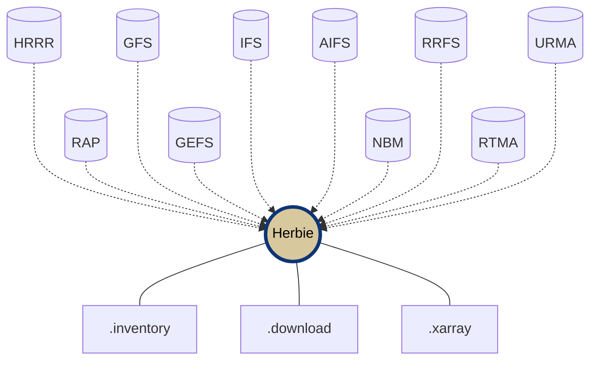

<div
  align="center"
>


# Herbie: Retrieve NWP Model Data 🏁

<!-- Badges -->

[
](https://pypi.org/project/herbie-data/) [](https://pypi.python.org/pypi/herbie-data/)
[
](https://anaconda.org/conda-forge/herbie-data)
[](https://zenodo.org/badge/latestdoi/275214142)

[](https://github.com/blaylockbk/Herbie/actions/workflows/tests-conda.yml)
[](https://github.com/blaylockbk/Herbie/actions/workflows/tests-python.yml)
[](https://herbie.readthedocs.io/?badge=latest)
[](https://anaconda.org/conda-forge/herbie-data)
[](https://github.com/astral-sh/ruff)


## [📘 Documentation](https://herbie.readthedocs.io/) | [💬 Discussions](https://github.com/blaylockbk/Herbie/discussions) | [❔ Ask For Help](https://github.com/blaylockbk/Herbie/discussions/categories/q-a)

<!-- (Badges) -->

</div>

**Herbie** is a python package that downloads recent and archived numerical weather prediction (NWP) model output from different cloud archive sources. NWP data is distributed in GRIB2 format which Herbie reads using xarray+cfgrib. Herbie also provides some extra features to help visualize and extract data.

Herbie helps you discover, download, and read data from:

- [High Resolution Rapid Refresh (HRRR)](https://herbie.readthedocs.io/en/latest/gallery/noaa_models/hrrr.html) | [HRRR-Alaska](https://herbie.readthedocs.io/en/latest/gallery/noaa_models/hrrrak.html)
- [Rapid Refresh (RAP)](https://herbie.readthedocs.io/en/latest/gallery/noaa_models/rap.html)
- [Global Forecast System (GFS)](https://herbie.readthedocs.io/en/latest/gallery/noaa_models/gfs.html)
- [Global Ensemble Forecast System (GEFS)](https://herbie.readthedocs.io/en/latest/gallery/noaa_models/gefs.html)
- [ECMWF Open Data Forecasts](https://herbie.readthedocs.io/en/latest/gallery/ecmwf_models/ecmwf.html) (IFS and AIFS)
- [Navy Global Environmental Model (NAVGEM)](https://herbie.readthedocs.io/en/latest/gallery/usnavy_models/navgem.html)
- [North American Mesoscale Model (NAM)](https://herbie.readthedocs.io/en/latest/gallery/noaa_models/nam.html)
- [National Blend of Models (NBM)](https://herbie.readthedocs.io/en/latest/gallery/noaa_models/nbm.html)
- [Rapid Refresh Forecast System (RRFS)](https://herbie.readthedocs.io/en/latest/gallery/noaa_models/rrfs.html) _prototype_
- [Real-Time/Un-Restricted Mesoscale Analysis (RTMA/URMA)](https://herbie.readthedocs.io/en/latest/gallery/noaa_models/rtma-urma.html)
- [Hurricane Analysis And Forecast System (HAFS)](https://herbie.readthedocs.io/en/latest/gallery/noaa_models/hafs.html)
- [High Resolution Deterministic Prediction System (HRDPS)](https://herbie.readthedocs.io/en/latest/gallery/eccc_models/hrdps.html)
- [Climate Forecast System (CFS)](https://herbie.readthedocs.io/en/latest/gallery/noaa_models/cfs.html)
- and more! Check out the [gallery](https://herbie.readthedocs.io/en/latest/gallery/index.html).

Much of this data is made available through the [NOAA Open Data Dissemination](https://www.noaa.gov/information-technology/open-data-dissemination) (NODD) program which has made weather data more accessible than ever before.

## Installation

### `conda` or `mamba`

The easiest way to instal Herbie and its dependencies is with [Conda](https://docs.conda.io/projects/conda/en/latest/user-guide/tasks/manage-environments.html) from conda-forge.

```bash
conda install -c conda-forge herbie-data
```

You may also create the provided Conda environment, **[`environment.yml`](https://github.com/blaylockbk/Herbie/blob/main/environment.yml)**.

```bash
# Download environment file
wget https://github.com/blaylockbk/Herbie/raw/main/environment.yml

# Modify that file if you wish.

# Create the environment
conda env create -f environment.yml

# Activate the environment
conda activate herbie
```

### `pip`

Alternatively, Herbie is published on PyPI and you can install it with pip.

```bash
# Latest published version
pip install herbie-data

# ~~ or ~~

# Most recent changes
pip install git+https://github.com/blaylockbk/Herbie.git

# Dependecies for extra features
pip install herbie-data[extra]
```

 Keep in mind that Herbie does require the following dependencies that you will have to install yourself if you don't have them in your PATH:

- Python 3.10+
- [cURL](https://anaconda.org/conda-forge/curl)
- [wgrib2](https://anaconda.org/conda-forge/wgrib2) (for some extra features)

### `uv`

You can add Herbie to your project with the uv command:

```bash
uv add herbie-data
```


## Capabilities

- Search for model output from different data sources.
- Download full GRIB2 files.
- Download subset GRIB2 files (by grib field).
- Read data with xarray.
- Read index file with Pandas.
- Extra features (herbie xarray accessors)
  - Extract data at a point
  - Get Cartopy coordinate references system
  - Plot data with Cartopy (very early development).
- Support for custom model templates with [Herbie plugins](https://github.com/blaylockbk/herbie-plugin-tutorial).



### Herbie Python

Herbie's Python API is used like this:

```python
from herbie import Herbie

# Herbie object for the HRRR model 6-hr surface forecast product
H = Herbie(
  '2021-01-01 12:00',
  model='hrrr',
  product='sfc',
  fxx=6
)

# Look at file contents
H.inventory()

# Download the full GRIB2 file
H.download()

# Download a subset, like all fields at 500 mb
H.download(":500 mb")

# Read subset with xarray, like 2-m temperature.
H.xarray("TMP:2 m")
```

### Herbie CLI

Herbie also has a command line interface (CLI) so you can use Herbie right in your terminal.

```bash
# Get the URL for a HRRR surface file from today at 12Z
herbie data -m hrrr --product sfc -d "2023-03-15 12:00" -f 0

# Download GFS 0.25° forecast hour 24 temperature at 850mb
herbie download -m gfs --product 0p25 -d 2023-03-15T00:00 -f 24 --subset ":TMP:850 mb:"

# View all available variables in a RAP model run
herbie inventory -m rap -d 2023031512 -f 0

# Download multiple forecast hours for a date range
herbie download -m hrrr -d 2023-03-15T00:00 2023-03-15T06:00 -f 1 3 6 --subset ":UGRD:10 m:"

# Specify custom source priority (check only Google)
herbie data -m hrrr -d 2023-03-15 -f 0 -p google
```
## Data Sources

Herbie downloads model data from the following sources, but can be extended to include others:

- [NOMADS](https://nomads.ncep.noaa.gov/)
- [NOAA Open Data Dissemination Program (NODD)](https://www.noaa.gov/information-technology/open-data-dissemination) partners (i.e., AWS, Google, Azure).
- [ECMWF Open Data Forecasts](https://www.ecmwf.int/en/forecasts/datasets/open-data)
- University of Utah CHPC Pando archive
- Local file system

## Community

Having trouble using Herbie or have a question? [❔ GitHub Discussions/Ask For Help](https://github.com/blaylockbk/Herbie/discussions/categories/q-a)

Just want to talk about Herbie or have an idea? [💬 GitHub Discussions](https://github.com/blaylockbk/Herbie/discussions/categories)

See something that might be wrong? [🚑 GitHub Issues](https://github.com/blaylockbk/Herbie/issues)

Want to contribute? Great! I'd love your help.

- "Watch" this repo's discussions and issues.
- Participate in [💬 GitHub Discussions](https://github.com/blaylockbk/Herbie/discussions/categories) and answer questions.
- Share how you use Herbie in [🙌 GitHub Discussions/Show and tell](https://github.com/blaylockbk/Herbie/discussions/categories/show-and-tell)
- Open an issue or file a pull request to make Herbie even better!
- Contribute to documentation.
- Test latest releases and report issues.
- Read the [👨🏻‍💻 Disclaimer & Contributing Guide](https://herbie.readthedocs.io/en/stable/user_guide/housekeeping/disclaimer.html)

## How to Cite and Acknowledge

If Herbie played an important role in your work, please [tell me about it](https://github.com/blaylockbk/Herbie/discussions/categories/show-and-tell)! Also, consider including a citation or acknowledgement in your article or product.

**_Suggested Citation_**

> Blaylock, B. K. (YEAR). Herbie: Retrieve Numerical Weather Prediction Model Data (Version 20xx.x.x) [Computer software]. https://doi.org/10.5281/zenodo.4567540

**_Suggested Acknowledgment_**

> A portion of this work used code generously provided by Brian Blaylock's Herbie python package (Version 20xx.x.x) (https://doi.org/10.5281/zenodo.4567540)

<hr>

## History

During my PhD at the University of Utah, I created, at the time, the [only publicly-accessible archive of HRRR data](http://hrrr.chpc.utah.edu/). Over 1,000 research scientists and professionals used that archive.

<blockquote><cite>
<p style="padding-left: 22px ; text-indent: -22px ;"> Blaylock B., J. Horel and S. Liston, 2017: Cloud Archiving and Data Mining of High Resolution Rapid Refresh Model Output. Computers and Geosciences. 109, 43-50. <a href="https://doi.org/10.1016/j.cageo.2017.08.005">https://doi.org/10.1016/j.cageo.2017.08.005</a>.</p>
</cite></blockquote>

Herbie was then developed to access HRRR data from that archive and was first used on the Open Science Grid.

<blockquote><cite>
<p style="padding-left: 22px ; text-indent: -22px ;"> Blaylock, B. K., J. D. Horel, and C. Galli, 2018: High-Resolution Rapid Refresh Model Data Analytics Derived on the Open Science Grid to Assist Wildland Fire Weather Assessment. J. Atmos. Oceanic Technol., 35, 2213–2227, <a href="https://doi.org/10.1175/JTECH-D-18-0073.1">https://doi.org/10.1175/JTECH-D-18-0073.1</a>.</p>
</cite></blockquote>

In the later half of 2020, the HRRR dataset from 2014 to present was made available through the [NODD Open Data Dissemination Program](https://www.noaa.gov/information-technology/open-data-dissemination) (formerly NOAA's Big Data Program). The latest version of Herbie organizes and expands my original download scripts into a more coherent package with the extended ability to download data for other models from many different archive sources, and it will continues to evolve.

I originally released this package under the name “HRRR-B” because it only worked with the HRRR dataset; the “B” was for Brian. Since then, I have added the ability to download many more models including RAP, GFS, ECMWF, GEFS, and RRFS with the potential to add more models in the future. Thus, this package was renamed **_Herbie_**, named after one of my favorite childhood movies.

The University of Utah MesoWest group now manages a [HRRR archive in Zarr format](http://hrrr.chpc.utah.edu/). Maybe someday, Herbie will be able to take advantage of that archive.

**Thanks for using Herbie, and happy racing!**

🏁 Brian

- [🌐 Personal Webpage](http://home.chpc.utah.edu/~u0553130/Brian_Blaylock/home.html)

<br>

P.S. If you like Herbie, check out my other repos:

- [🌎 GOES-2-go](https://github.com/blaylockbk/goes2go): A python package to download GOES-East/West data and make RGB composites.
- [🌡 SynopticPy](https://github.com/blaylockbk/SynopticPy): A python package to download mesonet data from the Synoptic API.
- [🔨 Carpenter Workshop](https://github.com/blaylockbk/Carpenter_Workshop): A python package with various tools I made that are useful (like easy funxtions to build Cartopy maps).
- [💬 Bubble Print](https://github.com/blaylockbk/BubblePrint): A silly little python package that gives your print statement's personality.
- [📜 MET Syntax](https://github.com/blaylockbk/vscode-met-syntax): An extension for Visual Studio Code that gives syntax highlighting for Model Evaluation Tools (MET) configuration files.

> **Note**: Alternative Download Tools  
> As an alternative to Herbie, you can use [rclone](https://rclone.org/) to download files from AWS or GCP. I love rclone. Here is a short [rclone tutorial](https://github.com/blaylockbk/pyBKB_v3/blob/master/rclone_howto.md)

| [Visualize Structure](https://mango-dune-07a8b7110.1.azurestaticapps.net/?repo=blaylockbk%2FHerbie) | [Star History](https://star-history.com/#blaylockbk/Herbie&Date) | [PyPI Download Statistics](https://pypistats.org/packages/herbie-data)
