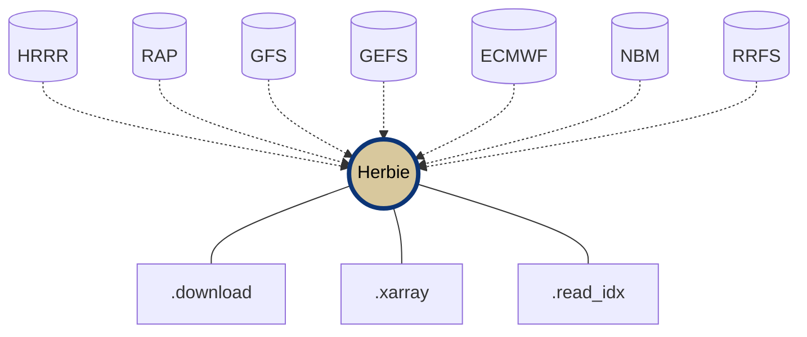

<div
  align="center"
>

  

# Herbie: Retrieve NWP Model Data 🏁

<!-- Badges -->

[](https://pypi.python.org/pypi/herbie-data/)
[](https://anaconda.org/conda-forge/herbie-data)
[](https://zenodo.org/badge/latestdoi/275214142)


[](https://github.com/psf/black)
[](https://github.com/blaylockbk/Herbie/actions/workflows/tests.yml)
[](https://anaconda.org/conda-forge/herbie-data)
[](https://anaconda.org/conda-forge/herbie-data)
[](https://anaconda.org/conda-forge/herbie-data)

<!-- (Badges) -->

</div>

**Herbie** is a python package that downloads recent and archived numerical weather prediction (NWP) model output from different cloud archive sources. **Its most popular capability is to download HRRR model data.** NWP data in GRIB2 format can be read with xarray+cfgrib. Much of this data is made available through the [NOAA Open Data Dissemination](https://www.noaa.gov/information-technology/open-data-dissemination) (NODD) Program (formerly the Big Data Program) which has made weather data more accessible than ever before.

Herbie helps you discover, download, and read data from:

- [High Resolution Rapid Refresh (HRRR)](https://blaylockbk.github.io/Herbie/_build/html/user_guide/_model_notebooks/hrrr.html) | [HRRR-Alaska](https://blaylockbk.github.io/Herbie/_build/html/user_guide/_model_notebooks/hrrrak.html)
- [Rapid Refresh (RAP)](https://blaylockbk.github.io/Herbie/_build/html/user_guide/_model_notebooks/rap.html)
- [Global Forecast System (GFS)](https://blaylockbk.github.io/Herbie/_build/html/user_guide/_model_notebooks/gfs.html)
- [Global Ensemble Forecast System (GEFS)](https://blaylockbk.github.io/Herbie/_build/html/user_guide/_model_notebooks/gefs.html)
- [ECMWF Open Data Forecast Products](https://blaylockbk.github.io/Herbie/_build/html/user_guide/_model_notebooks/ecmwf.html)
- [North American Mesoscale Model (NAM)](https://github.com/blaylockbk/Herbie/blob/main/docs/user_guide/_model_notebooks/nam.ipynb)
- [National Blend of Models (NBM)](https://blaylockbk.github.io/Herbie/_build/html/user_guide/_model_notebooks/nbm.html)
- [Rapid Refresh Forecast System - Prototype (RRFS)](https://blaylockbk.github.io/Herbie/_build/html/user_guide/_model_notebooks/rrfs.html)

# 📓 [Herbie Documentation](https://blaylockbk.github.io/Herbie/_build/html/)

## Installation

The easiest way to instal Herbie and its dependencies is with [Conda](https://docs.conda.io/projects/conda/en/latest/user-guide/tasks/manage-environments.html) from conda-forge.

```bash
conda install -c conda-forge herbie-data
```


You may also create the provided Conda environment, **[`environment.yml`](https://github.com/blaylockbk/Herbie/blob/main/environment.yml)**.

```bash
# Download environment file
wget https://github.com/blaylockbk/Herbie/raw/main/environment.yml

# Modify that file if you wish.

# Create the environment
conda env create -f environment.yml

# Activate the environment
conda activate herbie
```

Alternatively, Herbie is published on PyPI and you can install it with pip, _but_ it requires some dependencies that you will have to install yourself:

- Python 3.8, 3.9, or **3.10** (recommended)
- cURL
- [Cartopy](https://scitools.org.uk/cartopy/docs/latest/installing.html), which requires GEOS and Proj.
- [cfgrib](https://github.com/ecmwf/cfgrib), which requires eccodes.
- _Optional:_ wgrib2
- _Optional:_ [Carpenter Workshop](https://github.com/blaylockbk/Carpenter_Workshop)

When those are installed within your environment, _then_ you can install Herbie with pip.

```bash
# Latest published version
pip install herbie-data

# ~~ or ~~

# Most recent changes
pip install git+https://github.com/blaylockbk/Herbie.git
```

## Capabilities

- Search for model output from different data sources.
- Download full GRIB2 files.
- Download subset GRIB2 files (by grib field).
- Read data with xarray.
- Read index file with Pandas.
- Plot data with Cartopy (very early development).



```python
from herbie import Herbie

# Herbie object for the HRRR model 6-hr surface forecast product
H = Herbie(
  '2021-01-01 12:00',
  model='hrrr',
  product='sfc',
  fxx=6
)

# Download the full GRIB2 file
H.download()

# Download a subset, like all fields at 500 mb
H.download(":500 mb")

# Read subset with xarray, like 2-m temperature.
H.xarray("TMP:2 m")
```

## Data Sources

Herbie downloads model data from the following sources, but can be extended to include others:

- [NOMADS](https://nomads.ncep.noaa.gov/)
- Big Data Program Partners (AWS, Google, Azure)
- ECMWF Open Data Azure storage
- University of Utah CHPC Pando archive
- Local file system

## History

During my PhD at the University of Utah, I created, at the time, the [only publicly-accessible archive of HRRR data](http://hrrr.chpc.utah.edu/). Over 1,000 research scientists and professionals used that archive.

<blockquote><cite>
<p style="padding-left: 22px ; text-indent: -22px ;"> Blaylock B., J. Horel and S. Liston, 2017: Cloud Archiving and Data Mining of High Resolution Rapid Refresh Model Output. Computers and Geosciences. 109, 43-50. <a href="https://doi.org/10.1016/j.cageo.2017.08.005">https://doi.org/10.1016/j.cageo.2017.08.005</a></p>
</cite></blockquote>

In the later half of 2020, the HRRR dataset from 2014 to present was made available through the [NOAA Big Data Program](https://www.noaa.gov/information-technology/big-data). Herbie organizes and expands my original download scripts into a more coherent package with the extended ability to download data for other models from many different archive sources.

I originally released this package under the name “HRRR-B” because it only worked with the HRRR dataset; the “B” was for my first-name initial. Since then, I have added the ability to download RAP, GFS, ECMWF, GEFS, RRFS, and others with potentially more models in the future. Thus, this package was renamed **_Herbie_**, named after one of my favorite childhood movie characters.

The University of Utah MesoWest group now manages a [HRRR archive in Zarr format](http://hrrr.chpc.utah.edu/). Maybe someday, Herbie will be able to take advantage of that archive.

## How to Cite and Acknowledge
If Herbie played an important role in your work, please [tell me about it](https://github.com/blaylockbk/Herbie/discussions/categories/show-and-tell)! Also, consider including a citation or acknowledgement in your article or product.

***Suggested Citation***

> Blaylock, B. K. (2022). Herbie: Retrieve Numerical Weather Prediction Model Data (Version 2022.9.0) [Computer software]. https://github.com/blaylockbk/Herbie

***Suggested Acknowledgment***

> A portion of this work used code generously provided by Brian Blaylock's Herbie python package (https://github.com/blaylockbk/Herbie)

---

**Thanks for using Herbie, and happy racing!**

🏁 Brian

<br>

|     |                                                                                                       |
| :-: | ----------------------------------------------------------------------------------------------------- |
| 👨🏻‍💻  | [Contributing Guidelines](https://blaylockbk.github.io/Herbie/_build/html/user_guide/contribute.html) |
| 💬  | [GitHub Discussions](https://github.com/blaylockbk/Herbie/discussions)                                |
| 🚑  | [GitHub Issues](https://github.com/blaylockbk/Herbie/issues)                                          |
| 🌐  | [Personal Webpage](http://home.chpc.utah.edu/~u0553130/Brian_Blaylock/home.html)                      |
| 🌐  | [University of Utah HRRR archive](http://hrrr.chpc.utah.edu/)                                         |

Cite Herbie:

    Blaylock, B. K., 2022: Herbie: Retrieve Numerical Weather Prediction
    Model Data [Computer software]. https://doi.org/10.5281/zenodo.6526110.

<br>

P.S. If you like Herbie, check out my other repos:

- [🌎 GOES-2-go](https://github.com/blaylockbk/goes2go): A python package to download GOES-East/West data and make RGB composites.
- [🌡 SynopticPy](https://github.com/blaylockbk/SynopticPy): A python package to download mesonet data from the Synoptic API.
- [🔨 Carpenter Workshop](https://github.com/blaylockbk/Carpenter_Workshop): A python package with various tools I made that are useful (like easy funxtions to build Cartopy maps).
- [💬 Bubble Print](https://github.com/blaylockbk/BubblePrint): A silly little python package that gives your print statement's personality.
- [📜 MET Syntax](https://github.com/blaylockbk/vscode-met-syntax): An extension for Visual Studio Code that gives syntax highlighting for Model Evaluation Tools (MET) configuration files.

> **Note**: Alternative Download Tools  
> As an alternative to Herbie, you can use [rclone](https://rclone.org/) to download files from AWS or GCP. I love rclone. Here is a short [rclone tutorial](https://github.com/blaylockbk/pyBKB_v3/blob/master/rclone_howto.md)

| [Visualize Structure](https://mango-dune-07a8b7110.1.azurestaticapps.net/?repo=blaylockbk%2FHerbie) |
