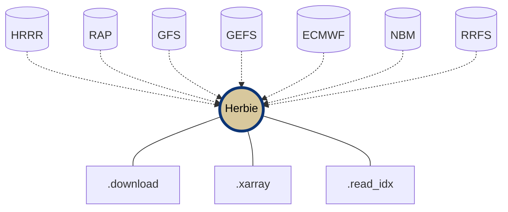

<div
  align="center"
>


# Herbie: Retrieve NWP Model Data 🏎🏁

<!-- Badges -->
[](https://pypi.python.org/pypi/herbie-data/)

[](https://zenodo.org/badge/latestdoi/275214142)
[](https://github.com/psf/black)

<!-- (Badges) -->

</div>

**Herbie** is a python package that downloads recent and archived numerical weather prediction (NWP) model output from different cloud archive sources. NWP data is usually in GRIB2 format and can be read with xarray+cfgrib. Much of this data is made available through the [NOAA Big Data Program](https://www.noaa.gov/information-technology/big-data) which has made weather data more accessible than ever before.

Herbie helps you discover and download data from:
- [High Resolution Rapid Refresh (HRRR)](https://blaylockbk.github.io/Herbie/_build/html/user_guide/notebooks/data_hrrr.html) | [HRRR-Alaska](https://blaylockbk.github.io/Herbie/_build/html/user_guide/notebooks/data_hrrrak.html)
- [Rapid Refresh (RAP)](https://blaylockbk.github.io/Herbie/_build/html/user_guide/notebooks/data_rap.html)
- [Global Forecast System (GFS)](https://blaylockbk.github.io/Herbie/_build/html/user_guide/notebooks/data_gfs.html)
- [Global Ensemble Forecast System (GEFS)](https://blaylockbk.github.io/Herbie/_build/html/user_guide/notebooks/data_gefs.html) ✨ new in Herbie 0.0.10
- [ECMWF Open Data Forecast Products](https://blaylockbk.github.io/Herbie/_build/html/user_guide/notebooks/data_ecmwf.html) ✨ new in Herbie 0.0.8
- [National Blend of Models (NBM)](https://blaylockbk.github.io/Herbie/_build/html/user_guide/notebooks/data_nbm.html)
- [Rapid Refresh Forecast System - Prototype (RRFS)](https://blaylockbk.github.io/Herbie/_build/html/user_guide/notebooks/data_rrfs.html)


# 📔 [Herbie Documentation](https://blaylockbk.github.io/Herbie/_build/html/)

## Install

Requires cURL and **Python 3.8+** with requests, numpy, pandas, xarray, and cfgrib. Optional packages are matplotlib, cartopy, and [Carpenter Workshop](https://github.com/blaylockbk/Carpenter_Workshop).

```bash
pip install herbie-data
```
or
```bash
pip install git+https://github.com/blaylockbk/Herbie.git
```

or, create the provided **[conda environment](https://github.com/blaylockbk/Herbie/blob/master/environment.yml)**.

## Capabilities

- Search different data sources for model output.
- Download full GRIB2 files
- Download subset GRIB2 files (by grib field)
- Read data with xarray
- Read index file with Pandas
- Plot data with Cartopy (very early development)




```python
from herbie.archive import Herbie

# Herbie object for the HRRR model 6-hr surface forecast product
H = Herbie(
  '2021-01-01 12:00',
  model='hrrr',
  product='sfc',
  fxx=6
)

# Download the full GRIB2 file
H.download()

# Download a subset, like all fields at 500 mb
H.download(":500 mb")

# Read subset with xarray, like 2-m temperature.
H.xarray("TMP:2 m")
```

## Data Sources

Herbie downloads model data from the following sources, but can be extended to include others:

- NOMADS
- Big Data Program Partners (AWS, Google, Azure)
- ECMWF Open Data Azure storage
- University of Utah CHPC Pando archive

## History

During my PhD at the University of Utah, I created, at the time, the [only publicly-accessible archive of HRRR data](http://hrrr.chpc.utah.edu/). Over 1,000 research scientists and professionals used that archive. 

> **✒  I wrote a paper about archiving HRRR data in the cloud**
>
> Blaylock B., J. Horel and S. Liston, 2017: Cloud Archiving and Data Mining of High Resolution Rapid Refresh Model Output. Computers and Geosciences. 109, 43-50. https://doi.org/10.1016/j.cageo.2017.08.005

In the later half of 2020, the HRRR data was made available through the [NOAA Big Data Program](https://www.noaa.gov/information-technology/big-data). Herbie organizes and expands my original download scripts into a more coherent package with the extended ability to download more than just the HRRR and RAP model data and from many different archive sources.

I originally released this package under the name “HRRR-B” because it only dealt with the HRRR data set and the “B” was for my first name initial. Since then, I have added the ability to download RAP, GFS, NBM, RRFS, and others with potentially more models in the future. Thus, this package was rename ***Herbie***, named after one of my favorite childhood movie characters.  


👨🏻‍💻 [Contributing Guidelines](https://blaylockbk.github.io/Herbie/_build/html/user_guide/contribute.html)  
💬 [GitHub Discussions](https://github.com/blaylockbk/Herbie/discussions)  
🚑 [GitHub Issues](https://github.com/blaylockbk/Herbie/issues)  
🌐 [Personal Webpage](http://home.chpc.utah.edu/~u0553130/Brian_Blaylock/home.html)  
🌐 [University of Utah HRRR archive](http://hrrr.chpc.utah.edu/) 

Thanks for using Herbie, and Happy Racing 🏎🏁

\- Brian  


P.S. If you like Herbie, check out my other repos:
- [🌎 GOES-2-go](https://github.com/blaylockbk/goes2go): A python package to download GOES-East/West data and make RGB composites.
- [🌡 SynopticPy](https://github.com/blaylockbk/SynopticPy): A python package to download mesonet data from the Synoptic API.
- [🔨 Carpenter Workshop](https://github.com/blaylockbk/Carpenter_Workshop): A python package with various tools I made that are useful (like easy funxtions to build Cartopy maps).
- [💬 Bubble Print](https://github.com/blaylockbk/BubblePrint): A silly little python package that gives your print statement's personality.
- [📜 MET Syntax](https://github.com/blaylockbk/vscode-met-syntax): An extension for Visual Studio Code that gives syntax highlighting for Model Evaluation Tools (MET) configuration files.

---

### Alternative Download Tools

As an alternative you can use [rclone](https://rclone.org/) to download files from AWS or GCP. I quite like rclone. Here is a [short rclone tutorial](https://github.com/blaylockbk/pyBKB_v3/blob/master/rclone_howto.md)


 


