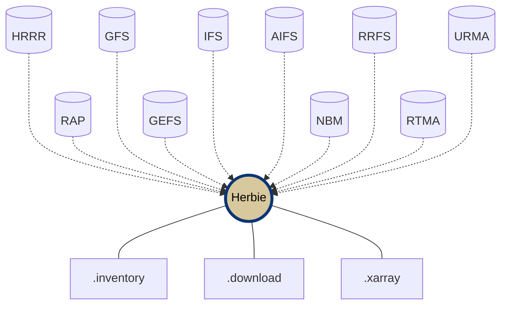

<div align="center">


# Herbie: Download Weather Forecast Model Data in Python 🏁

**Access HRRR, GFS, RAP, GEFS, IFS and more!**

<!-- Badges -->

[](https://pypi.org/project/herbie-data/) 
[](https://pypi.python.org/pypi/herbie-data/)
[](https://anaconda.org/conda-forge/herbie-data)
[](https://zenodo.org/badge/latestdoi/275214142)

[](https://github.com/blaylockbk/Herbie/actions/workflows/tests-conda.yml)
[](https://github.com/blaylockbk/Herbie/actions/workflows/tests-python.yml)
[](https://herbie.readthedocs.io/?badge=latest)
[](https://github.com/astral-sh/ruff)

[](https://anaconda.org/conda-forge/herbie-data)
[](https://pypistats.org/packages/herbie-data)


## 📚 [Documentation](https://herbie.readthedocs.io/) | 💬 [Discussions](https://github.com/blaylockbk/Herbie/discussions) | ❔ [Get Help](https://github.com/blaylockbk/Herbie/discussions/categories/q-a)

<!-- (Badges) -->

</div>

---

## What is Herbie?

Herbie is a Python package that makes downloading and working with numerical weather prediction (NWP) model data simple and fast. Whether you're a researcher, meteorologist, data scientist, or weather enthusiast, Herbie provides easy access to forecast data from NOAA, ECMWF, and other sources.

**Key Features:**
- 🌐 **Access 15+ weather models** - HRRR, GFS, RAP, GEFS, ECMWF, and more
- ⚡ **Smart downloads** - Get full GRIB2 files or subset by variable to save time and bandwidth
- 🔄 **Multiple data sources** - Automatically searches different archive (AWS, Google Cloud, NOMADS, Azure)
- 📊 **Built-in data reading** - Load data directly into xarray for analysis
- 🛠️ **CLI and Python API** - Use from command line or in your Python scripts
- 🗺️ **Visualization aids** - Includes Cartopy integration for mapping

**Keywords:** weather data download, GRIB2, python, numerical weather prediction, meteorological data, weather forecast API, xarray, atmospheric data, research, academia, data science, machine learning,visualization

---

## Quick Start

### Installation

**With conda or mamba:**
```bash
conda install -c conda-forge herbie-data
```
```bash
mamba install -c conda-forge herbie-data
```

**With pip:**
```bash
pip install herbie-data
```

**With uv:**
```bash
uv add herbie-data
```

*Note: optional features require manual installation of wgrib2*

### Simple Example

```python
from herbie import Herbie

# Create a Herbie object for HRRR model data
H = Herbie(
    '2021-01-01 12:00',  # Date and time
    model='hrrr',         # Model name
    product='sfc',        # Product type
    fxx=6                 # Forecast hour
)

# Show file contents
H.inventory()

# Download and read 2-meter temperature
temperature = H.xarray("TMP:2 m")
```

### Command Line Interface

```bash
# Download HRRR surface forecast
herbie download -m hrrr --product sfc -d "2023-03-15 12:00" -f 0

# Get specific variable (temperature at 850 mb)
herbie download -m gfs --product 0p25 -d 2023-03-15 -f 24 --subset ":TMP:850 mb:"

# View available variables
herbie inventory -m rap -d 2023031512 -f 0
```

---

## Supported Weather Models

Herbie provides access to a wide range of numerical weather prediction models:

### US Models (NOAA)
- **[HRRR](https://herbie.readthedocs.io/en/latest/gallery/noaa_models/hrrr.html)** - High Resolution Rapid Refresh (3km resolution)
- **[HRRR-Alaska](https://herbie.readthedocs.io/en/latest/gallery/noaa_models/hrrrak.html)** - Alaska version
- **[GFS](https://herbie.readthedocs.io/en/latest/gallery/noaa_models/gfs.html)** - Global Forecast System
- **[GEFS](https://herbie.readthedocs.io/en/latest/gallery/noaa_models/gefs.html)** - Global Ensemble Forecast System
- **[RAP](https://herbie.readthedocs.io/en/latest/gallery/noaa_models/rap.html)** - Rapid Refresh
- **[NAM](https://herbie.readthedocs.io/en/latest/gallery/noaa_models/nam.html)** - North American Mesoscale Model
- **[NBM](https://herbie.readthedocs.io/en/latest/gallery/noaa_models/nbm.html)** - National Blend of Models
- **[RTMA/URMA](https://herbie.readthedocs.io/en/latest/gallery/noaa_models/rtma-urma.html)** - Real-Time/Un-Restricted Mesoscale Analysis
- **[RRFS](https://herbie.readthedocs.io/en/latest/gallery/noaa_models/rrfs.html)** - Rapid Refresh Forecast System *(prototype)*
- **[HAFS](https://herbie.readthedocs.io/en/latest/gallery/noaa_models/hafs.html)** - Hurricane Analysis and Forecast System
- **[CFS](https://herbie.readthedocs.io/en/latest/gallery/noaa_models/cfs.html)** - Climate Forecast System

Much of this data is made available through the [NOAA Open Data Dissemination](https://www.noaa.gov/information-technology/open-data-dissemination) (NODD) program.

### Other Models
- **[ECMWF](https://herbie.readthedocs.io/en/latest/gallery/ecmwf_models/ecmwf.html)** - ECMWF's IFS and AIFS Open Data Forecasts
- **[HRDPS](https://herbie.readthedocs.io/en/latest/gallery/eccc_models/hrdps.html)** - Canada's High Resolution Deterministic Prediction System (Canada)
- **[NAVGEM](https://herbie.readthedocs.io/en/latest/gallery/usnavy_models/navgem.html)** - U.S. Navy Global Environmental Model

**[View all models in the gallery →](https://herbie.readthedocs.io/en/latest/gallery/index.html)**


---

## Core Capabilities

**Features:**
- 🔍 Search model output from different data sources
- ⬇️ Download full or subset GRIB2 files
- 📖 Read data with xarray and index files with Pandas
- 🗺️ Built-in Cartopy aids for mapping
- 🎯 Extract data at specific points
- 🔌 Extensible with [custom model templates](https://github.com/blaylockbk/herbie-plugin-tutorial)




### Python API

Herbie's Python API is used like this:

```python
from herbie import Herbie

# Herbie object for the HRRR model 6-hr surface forecast product
H = Herbie(
  '2021-01-01 12:00',
  model='hrrr',
  product='sfc',
  fxx=6
)

# View all variables in a file
H.inventory()

# Download options
H.download()              # Download full GRIB2 file
H.download(":500 mb")     # Download subset (all 500 mb fields)
H.download(":TMP:2 m")    # Download specific variable

# Read data into xarray
ds = H.xarray("TMP:2 m")  # 2-meter temperature
ds = H.xarray(":500 mb")  # All 500 mb level data
```

### Command Line Interface

Herbie also has a command line interface (CLI) so you can use Herbie right in your terminal.

```bash
# Get the URL for a HRRR surface file from today at 12Z
herbie data -m hrrr --product sfc -d "2023-03-15 12:00" -f 0

# Download GFS 0.25° forecast hour 24 temperature at 850mb
herbie download -m gfs --product 0p25 -d 2023-03-15T00:00 -f 24 --subset ":TMP:850 mb:"

# View all available variables in a RAP model run
herbie inventory -m rap -d 2023031512 -f 0

# Download multiple forecast hours for a date range
herbie download -m hrrr -d 2023-03-15T00:00 2023-03-15T06:00 -f 1 3 6 --subset ":UGRD:10 m:"

# Specify custom source priority (check only Google)
herbie data -m hrrr -d 2023-03-15 -f 0 -p google
```
## Data Sources

Herbie automatically searches for data at multiple data sources:

- [NOMADS](https://nomads.ncep.noaa.gov/)
- [NOAA Open Data Dissemination Program (NODD)](https://www.noaa.gov/information-technology/open-data-dissemination) partners (i.e., AWS, Google, Azure).
- [ECMWF Open Data Forecasts](https://www.ecmwf.int/en/forecasts/datasets/open-data)
- University of Utah CHPC Pando archive
- Local file system

---

## Documentation & Help

📘 **[Full Documentation](https://herbie.readthedocs.io/)** - Comprehensive guides and API reference

🖼️ **[Example Gallery](https://herbie.readthedocs.io/en/latest/gallery/index.html)** - Browse code examples for each model

💬 **[GitHub Discussions](https://github.com/blaylockbk/Herbie/discussions)** - Ask questions and share ideas

🚑 **[Report Issues](https://github.com/blaylockbk/Herbie/issues)** - Found a bug? Let us know

---

## Citation & Acknowledgment

If Herbie played an important role in your work, please [tell us about it](https://github.com/blaylockbk/Herbie/discussions/categories/show-and-tell)! 

### Suggested Citation

> Blaylock, B. K. (YEAR). Herbie: Retrieve Numerical Weather Prediction Model Data (Version 20xx.x.x) [Computer software]. https://doi.org/10.5281/zenodo.4567540

### Suggested Acknowledgment

> A portion of this work used code generously provided by Brian Blaylock's Herbie python package (https://doi.org/10.5281/zenodo.4567540)

---

## Contributing

We welcome contributions! Here's how you can help:

- ⭐ Star this repository
- 👀 Watch for new discussions and issues
- 💬 Participate in [GitHub Discussions](https://github.com/blaylockbk/Herbie/discussions)
- 🙌 Share your work in [Show and Tell](https://github.com/blaylockbk/Herbie/discussions/categories/show-and-tell)
- 🐛 Report bugs or suggest features via [Issues](https://github.com/blaylockbk/Herbie/issues)
- 📝 Improve documentation
- 🧪 Test latest releases
- 💻 Submit pull requests

Read the [Contributing Guide](https://herbie.readthedocs.io/en/stable/user_guide/housekeeping/disclaimer.html) for more details.

---


## Project History and Background

During my PhD at the University of Utah, I created, at the time, the [only publicly-accessible archive of HRRR data](http://hrrr.chpc.utah.edu/). Over 1,000 research scientists and professionals used that archive.

<blockquote><cite>
<p style="padding-left: 22px ; text-indent: -22px ;"> Blaylock B., J. Horel and S. Liston, 2017: Cloud Archiving and Data Mining of High Resolution Rapid Refresh Model Output. Computers and Geosciences. 109, 43-50. <a href="https://doi.org/10.1016/j.cageo.2017.08.005">https://doi.org/10.1016/j.cageo.2017.08.005</a>.</p>
</cite></blockquote>

Herbie was then developed to access HRRR data from that archive and was first used on the Open Science Grid.

<blockquote><cite>
<p style="padding-left: 22px ; text-indent: -22px ;"> Blaylock, B. K., J. D. Horel, and C. Galli, 2018: High-Resolution Rapid Refresh Model Data Analytics Derived on the Open Science Grid to Assist Wildland Fire Weather Assessment. J. Atmos. Oceanic Technol., 35, 2213–2227, <a href="https://doi.org/10.1175/JTECH-D-18-0073.1">https://doi.org/10.1175/JTECH-D-18-0073.1</a>.</p>
</cite></blockquote>

In 2020, the HRRR dataset was made available through the [NOAA Open Data Dissemination Program](https://www.noaa.gov/information-technology/open-data-dissemination). Herbie evolved from my original download scripts into a comprehensive package supporting multiple models and data sources.

**Name Origin:** I originally released this package under the name “HRRR-B” because it only worked with the HRRR dataset; the “B” was for Brian. Since then, I have added the ability to download many more models including RAP, GFS, ECMWF, GEFS, and RRFS with the potential to add more models in the future. Thus, this package was renamed **_Herbie_**, named after one of my favorite childhood movies.

The University of Utah MesoWest group now manages a [HRRR archive in Zarr format](http://hrrr.chpc.utah.edu/). Maybe someday, Herbie will be able to take advantage of that archive.

## About the Author

**Thanks for using Herbie, and happy racing!** 🏁

Brian Blaylock  
[🌐 Personal Webpage](http://home.chpc.utah.edu/~u0553130/Brian_Blaylock/home.html)

### Other Projects by Brian

- [🌎 **GOES-2-go**](https://github.com/blaylockbk/goes2go) - Download GOES satellite data and create RGB composites
- [🌡 **SynopticPy**](https://github.com/blaylockbk/SynopticPy) - Access mesonet data from the Synoptic API  
- [🔨 **Carpenter Workshop**](https://github.com/blaylockbk/Carpenter_Workshop) - Useful tools for meteorological data analysis
- [💬 **Bubble Print**](https://github.com/blaylockbk/BubblePrint) - Add personality to your Python print statements
- [🌹 **Pandas Rose**](https://github.com/blaylockbk/pandas-rose) - Easier wind rose plots
- [📜 **MET Syntax**](https://github.com/blaylockbk/vscode-met-syntax) - VS Code syntax highlighting for Model Evaluation Tools

---

## Alternative Tools

**rclone:** As an alternative to Herbie, you can use [rclone](https://rclone.org/) to download files from remote archives. I love rclone. Here's a [short rclone tutorial](https://github.com/blaylockbk/pyBKB_v3/blob/master/rclone_howto.md).

---

## Project Statistics

| [Visualize Structure](https://mango-dune-07a8b7110.1.azurestaticapps.net/?repo=blaylockbk%2FHerbie) | [Star History](https://star-history.com/#blaylockbk/Herbie&Date) | [PyPI Statistics](https://pypistats.org/packages/herbie-data) |
|---|---|---|
