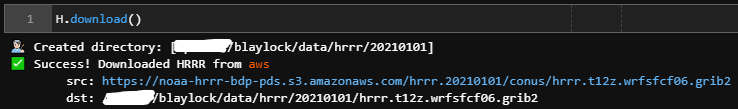
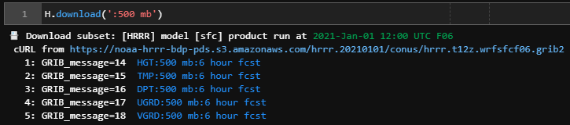

.. image:: _static/HerbieLogo2_tan_transparent.png

===============================
Herbie: Retrieve NWP Model Data
===============================
**Herbie** is a python package that download recent and archived numerical weather prediction (NWP) model output from different cloud archive sources. This data is usually in GRIB2 format and can be read with xarray/cfgrib. Model data Herbie can retrieve includes the High Resolution Rapid Refresh (HRRR), Rapid Refresh (RAP), Global Forecast System (GFS), National Blend of Models (NBM), and Rapid Refresh Forecast System - Prototype (RRFS).

.. toctree::
   :maxdepth: 1

   /user_guide/index
   /reference_guide/index

Capabilities
------------

Download Model Data
^^^^^^^^^^^^^^^^^^^
Herbie can download full or partial GRIB2 files from different models, including the following:

- High Resolution Rapid Refresh (HRRR)
- High Resolution Rapid Refresh - Alaska (HRRRAK)
- Rapid Refresh (RAP)
- Global Forecast System (GFS)
- Global Forecast System - Wave (GFS-Wave)
- Rapid Refresh Forecast System - Prototype (RRFS)
- National Blend of Models (NMB)

**Subsetting these files by GRIB message** is also supported, provided that an index (.idx) file exists. For more information about subsetting, read :ref:`What is GRIB2? <GRIB2_FAQ>`

Data Sources 
""""""""""""
Thanks to the `NOAA Big Data Program <https://www.noaa.gov/information-technology/big-data>`_ weather data is more easily accessible than ever before. Common data sources include

- `NOAA NOMADS Server <https://nomads.ncep.noaa.gov/>`_ (most recent data, but not archived)
- `Amazon Web Services <https://registry.opendata.aws/noaa-hrrr-pds/>`_
- `Google Cloud Platform <https://console.cloud.google.com/marketplace/product/noaa-public/hrrr>`_
- `Microsoft Azure <https://github.com/microsoft/AIforEarthDataSets/blob/main/data/noaa-hrrr.md>`_
- `University of Utah Pando Archive <http://hrrr.chpc.utah.edu/>`_

Read GRIB2 Data
^^^^^^^^^^^^^^^
Herbie can help you read these files with `xarray <http://xarray.pydata.org/en/stable/>`_ via `cfgrib <https://github.com/ecmwf/cfgrib>`_.

Plot Fields
^^^^^^^^^^^
🏗 Under construction. I want to make some useful xarray accessors for plotting the GRIB2 fields. This will use tools I am developing in my `Carpenter Workshop <https://github.com/blaylockbk/Carpenter_Workshop>`_ package to plot the data on a Cartopy map or pluck points nearest specific latitudes and longitudes.

Install
-------
Herbie requires **Python 3.8+**

Install with pip

.. code:: bash

   pip install hrrrb

   # or

   pip install git+https://github.com/blaylockbk/Herbie.git

To install within a conda environment file, you may use this minimum `environment.yml
<https://github.com/blaylockbk/Herbie/blob/master/environment.yml>`_ file 
and create the environment with the following...

.. code:: bash

   # Create the environment
   conda env create -f environment.yml

   # Update the environment
   conda env update -f environment.yml

   # Activate the environment
   conda activate herbie

General Usage
-------------

Create a Herbie object for the HRRR model sfc product and 6 hour forecast.

.. code-block:: python

   from herbie.archive import Herbie
   H = Herbie('2021-01-01 12:00', model='hrrr', product='sfc', fxx=6)

.. image:: _static/screenshots/usage_1.png
|
|
Download the full GRIB2 file

.. code-block:: python

   H.download()

|
|
Download a subset

.. code-block:: python

   # Download all fields at 500 mb level
   H.download(':500 mb')

|
|
Open a subset with xarray

.. code-block:: python

   # Open 2-m Temperature field
   H.xarray('TMP:2 m')

.. image:: _static/screenshots/usage_4.png
|
|
Bulk Download

.. code-block:: python

   from herbie.tools import bulk_download
   import pandas as pd

   # Download HRRR analysis for every hour of a day
   DATES = pd.date_range('2021-01-01', '2021-01-02', freq='1H')
   bulk_download(DATES, model='hrrr', product='sfc', fxx=0)

History
-------
**👨🏻‍🎓 During my PhD at the University of Utah**, I created, at the time, the only publicly-accessible archive of HRRR data. In the later half of 2020, this data was made available through the `NOAA Big Data Program <https://www.noaa.gov/information-technology/big-data>`_. The Herbie package organizes and expands my original download scripts into a more coherent package with the extended ability to download more than just the HRRR and RAP model data and from different data sources. It will continue to evolve at my own leisure.

**🌹 What's in a name?** I originally released this package under the name "HRRR-B" because it only dealt with the HRRR data set and the "B" is for my initial. Since then, I have added the ability to download RAP, GFS, NBM, RRFS, and potentially more models in the future. Also, there is an archive of HRRR data in Zarr format, and Herbie could potentially be used to download that format. Thus, it was re-branded with the name "Herbie," named after a favorite childhood movie. For now, it is still called "hrrrb" on PyPI because "herbie" is already taken.

.. figure:: _static/Herbie3.png
   :class: img-fluid
   :width: 66%

**🛰 GOES ABI and GLM data** can be downloaded from AWS with my `goes-2-go <https://github.com/blaylockbk/goes2go/tree/master/goes2go>`_ package. This package was also originally developed during grad school and has been updated.

Indices and tables
==================

* :ref:`genindex`
* :ref:`modindex`
* :ref:`search`
