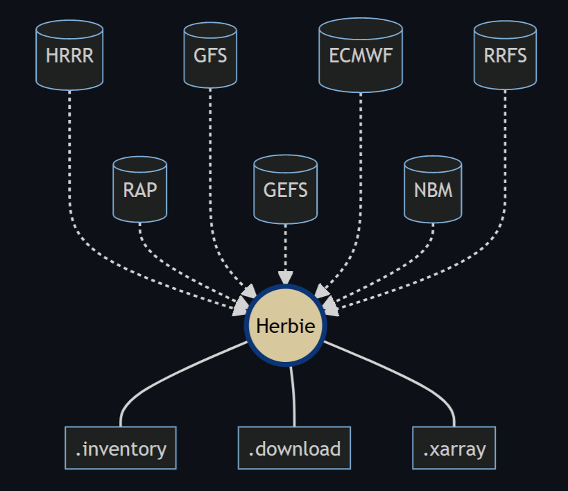

.. .. image:: _static/HerbieLogo2_tan_transparent.png

.. This drop-shadow glow on the logo helps when in Darkmode

.. raw :: html

   

===============================
Herbie: Retrieve NWP Model Data
===============================

**Herbie** is a python package that downloads recent and archived numerical weather prediction (NWP) model output from different cloud archive sources. **Its most popular capability is to download HRRR model data.** NWP data in the GRIB2 format can be read with xarray+cfgrib.

Some models Herbie can retrieve data from include:

- High-Resolution Rapid Refresh (HRRR)
- Rapid Refresh (RAP)
- Global Forecast System (GFS)
- National Blend of Models (NBM)
- Rapid Refresh Forecast System - Prototype (RRFS)
- ECMWF open data forecast products (ECMWF).
- and others.

.. toctree::
   :maxdepth: 1

   /user_guide/index
   /api_reference/index

.. TODO: I'd like to have the cards here instead of the toctree, but the toctree is needed to show the links in the top banner.
.. .. card:: User Guide
..     :link: https://blaylockbk.github.io/Herbie/_build/html/user_guide/index.html

..     Information you need to know to use Herbie.

.. .. card:: Reference Guide
..     :link: https://blaylockbk.github.io/Herbie/_build/html/reference_guide/index.html

..     API reference for Herbie's classes and functions.

Installation
------------
The easiest way to install Herbie and its dependencies is with Conda.

.. code-block:: bash

   conda install -c conda-forge herbie-data

More details at :ref:`🐍 Installation`.

Capabilities
------------

Herbie helps you discover and use data from many different numerical weather models and sources.

Specifically, Herbie can

- Locate GRIB2 files in the cloud.
- Explore the content of those files.
- Download data to your computer.
- Download *subsets*  of the data.
- Read the data with xarray.
- Accessors to help with plotting.
- Accessors for extracting data.

More details at :ref:`👨🏻‍💻 Tutorials` in the User Guide.

