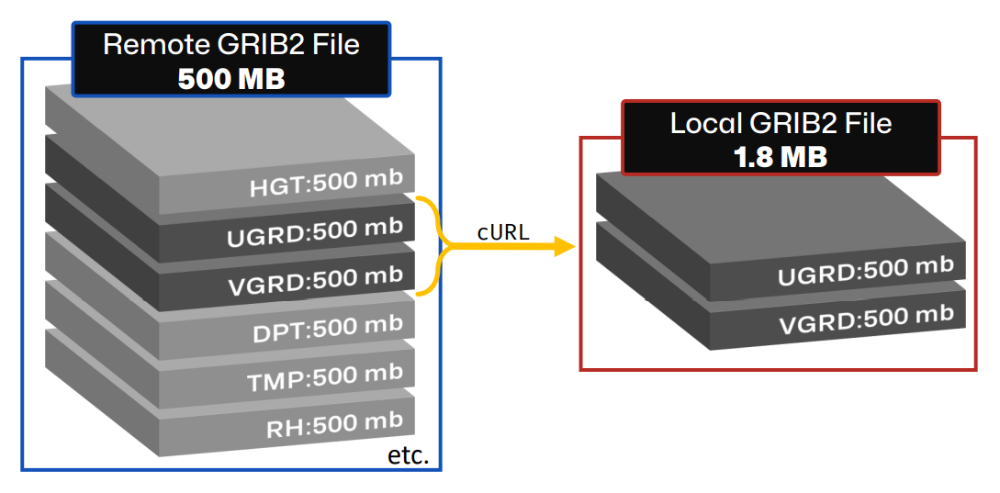

# 🔢 What is GRIB2?

GRIB stands for "gridded binary" and is an international standard for meteorological data. There is an old standard GRIB, and a new standard GRIB2. In these documents, when I refer to GRIB I really mean the new GRIB2 standard.

Yes, GRIB is notoriously difficult to work with and has a steep learning curve for those unfamiliar with the format. I won't discuss here the good, bad, and ugly of GRIB frankly because I'm not an expert and probably will say something wrong. However, even seasoned meteorologists complain about GRIB. Since complaining won't fix the problem, I choose to embrace it because, for now, NWP data is widely distributed as GRIB2.

- [Wikipedia: GRIB](https://en.wikipedia.org/wiki/GRIB)
- [ECMWF: What are GRIB files and how can I read them?](https://confluence.ecmwf.int/display/CKB/What+are+GRIB+files+and+how+can+I+read+them)

### Command Line Tools

There are two command-line tools for looking at GRIB file contents.

1. _wgrib2_ is a product of NOAA/NCEP and can be installed via conda-forge in your environment (Linux only). See [wrgib2 documentation](https://www.cpc.ncep.noaa.gov/products/wesley/wgrib2/).
2. _grib_ls_ in the ecCodes package is a product of ECMWF. Since ecCodes is a dependency of cfgrib, this utility is included when you install cfgrib in your conda environment. See [grib_ls documentation](https://confluence.ecmwf.int/display/ECC/grib_ls).

These can easily be installed with conda. (Note: wgrib2 only works on linux)

```bash
conda install -c conda-forge wgrib2 eccodes
```

For a sample GRIB2 file with precipitation data, below is the output using both tools

```bash
$ wgrib2 subset_20201214_hrrr.t00z.wrfsfcf12.grib2
```

> Output:
>
> ```
> 1:0:d=2020121400:APCP:surface:0-12 hour acc fcst:
> 2:887244:d=2020121400:APCP:surface:11-12 hour acc fcst:
> ```

```bash
$ grib_ls subset_20201214_hrrr.t00z.wrfsfcf12.grib2
```

> Output:
>
> ```
> subset_20201214_hrrr.t00z.wrfsfcf12.grib2
> edition      centre       date         dataType     gridType     typeOfLevel  level        stepRange    shortName    packingType
> 2            kwbc         20201214     fc           lambert      surface      0            0-12         tp           grid_complex_spatial_differencing
> 2            kwbc         20201214     fc           lambert      surface      0            11-12        tp           grid_complex_spatial_differencing
> 2 of 2 messages in subset_20201214_hrrr.t00z.wrfsfcf12.grib2
>
> 2 of 2 total messages in 1 files
> ```

Of course, there are many more command line options to get more data than was returned in this example.

### Python Tools

There are two key python packages for reading GRIB2 files. Both can be installed via conda-forge.

- **pygrib** is what I started to learn and still use sometimes.
  - [Video Demo](https://youtu.be/yLoudFv3hAY)
  - [pygrib GitHub](https://github.com/jswhit/pygrib)
- **cfgrib** works well reading GRIB2 data as xarray datasets. Make sure you have the latest version (>0.9.8)
  - [cfgrib GitHub](https://github.com/ecmwf/cfgrib)

```bash
conda install -c conda-forge pygrib cfgrib
```

## How GRIB subsetting works in Herbie

GRIB files are gridded binary where GRIB _messages_ or _fields_ are stacked on top of each other in a file. A message might contain temperature data for a level (e.g., surface, 500 hPa) at a specific time across the United States. I like to think of each message as a "layer" in the file.

Because the file is made up of individual "messages," it is possible to download portions of GRIB2 file by retrieving just specific messages using HTTP [Byte-Range request](https://www.keycdn.com/support/byte-range-requests).

Herbie supports **subsetting GRIB2 files by GRIB message**, provided that an _inventory_ or _index_ (.idx) file exists. The index file tells us the beginning byte of each GRIB message. To download a subset, Herbie uses the **cURL** command which allows you to download a range of bytes from a file. By repeating the cURL command and appending the messages you a file, you can subset a full file on the remote server and download only the fields you need. Keep in mind that a GRIB message represents the variable over the full grid. It is only possible to subset the file by GRIB message and not by geographical region (i.e., you cannot do a regional subset).

Why would you want to subset GRIB2 files? Well, GRIB files provided by operational forecast centers are usually very large because they can contain hundreds of model output variables, and each variable is its own GRIB message. For example, native grid HRRR files can be ~700 MB each! That adds up quick if you need a lot of days and forecasts and all you are interested in surface temperature. Often, you only need some of the data in the file. The size of a single HRRR message is about 1 MB. If you subset the data as you download it, you will save a lot of disk space and improve your data acquisition time by reducing the download time.



GRIB2 files are made up of messages or _fields_ that can be extracted instead of downloading the full file.

The challenge to downloading parts of the full GRIB2 file finding the byte range for a variable you want, but that is what Herbie does for you. Herbie looks at the index file, identifies the variables you want and its byte range, and downloads each message you request with cURL.

Each GRIB2 file has a unique index file and looks something like this example from the HRRR model. This is an example of the wgrib2-style index file and are provided for NCEP models:

```
1:0:d=2021072701:REFC:entire atmosphere:anl:
2:354859:d=2021072701:RETOP:cloud top:anl:
3:624897:d=2021072701:var discipline=0 center=7 local_table=1 parmcat=16 parm=201:entire atmosphere:anl:
4:1037681:d=2021072701:VIL:entire atmosphere:anl:
5:1332326:d=2021072701:VIS:surface:anl:
6:2730828:d=2021072701:REFD:1000 m above ground:anl:
7:2921075:d=2021072701:REFD:4000 m above ground:anl:
8:3140924:d=2021072701:REFD:263 K level:anl:
9:3364551:d=2021072701:GUST:surface:anl:
10:4522696:d=2021072701:UGRD:250 mb:anl:
11:5299993:d=2021072701:VGRD:250 mb:anl:
12:6083105:d=2021072701:UGRD:300 mb:anl:
13:6840781:d=2021072701:VGRD:300 mb:anl:
14:7614021:d=2021072701:HGT:500 mb:anl:
15:8356201:d=2021072701:TMP:500 mb:anl:
16:8898145:d=2021072701:DPT:500 mb:anl:
17:9954184:d=2021072701:UGRD:500 mb:anl:
18:10538876:d=2021072701:VGRD:500 mb:anl:
```

Each part has meaning as described in the figure


ECMWF products use a different pattern for their index files (I believe created with the ecCodes/grib_ls tool). The important thing here is that these also tell us what variable is in each GRIB message and the start and end byte. Here is an example of one of the ECMWF index files:

```json
{"domain": "g", "date": "20220125", "time": "1800", "expver": "0001", "class": "od", "type": "pf", "stream": "enfo", "levtype": "sfc", "number": "4", "step": "0", "param": "tp", "_offset": 0, "_length": 243}
{"domain": "g", "date": "20220125", "time": "1800", "expver": "0001", "class": "od", "type": "pf", "stream": "enfo", "levtype": "sfc", "number": "2", "step": "0", "param": "tp", "_offset": 243, "_length": 243}
{"domain": "g", "date": "20220125", "time": "1800", "expver": "0001", "class": "od", "type": "pf", "stream": "enfo", "levtype": "sfc", "number": "3", "step": "0", "param": "tp", "_offset": 486, "_length": 243}
{"domain": "g", "date": "20220125", "time": "1800", "expver": "0001", "class": "od", "type": "pf", "stream": "enfo", "step": "0", "levtype": "sfc", "number": "8", "param": "2t", "_offset": 729, "_length": 609069}
{"domain": "g", "date": "20220125", "time": "1800", "expver": "0001", "class": "od", "type": "pf", "stream": "enfo", "levtype": "sfc", "number": "33", "step": "0", "param": "tp", "_offset": 609798, "_length": 243}
{"domain": "g", "date": "20220125", "time": "1800", "expver": "0001", "class": "od", "type": "pf", "stream": "enfo", "levtype": "sfc", "number": "34", "step": "0", "param": "tp", "_offset": 610041, "_length": 243}
{"domain": "g", "date": "20220125", "time": "1800", "expver": "0001", "class": "od", "type": "pf", "stream": "enfo", "levtype": "sfc", "number": "23", "step": "0", "param": "tp", "_offset": 610284, "_length": 243}
```

From these index files, we know the byte range of specific GRIB messages. This enables us to do a byte-range request. For example, we can call the cURL command to download a valid GRIB2 file with only the 2-meter temperature variable.

```bash
curl -o outFile.grib2 --range 34884036-36136433 https://pando-rgw01.chpc.utah.edu/hrrr/sfc/20180101/hrrr.t00z.wrfsfcf00.grib2
```

You could repeat the cURL download for different ranges append several variables output to the same file.

```bash
curl --range ######-###### >> outFile.grib2
```

For Herbie to download a subset of the file, this index file must exist on a remote server. Without the index file, it is impossible to know the byte range for each variable. If the index files do not exist, ask the data provider to generate the inventory files and host them on the remote server. The wgrib2-style index files can be created using wgrib2 with the following command:

```bash
wgrib2 -s file.grib2 > file.grib2.idx
```

Generally speaking, index files share the same URL as the GRIB2 file except with `.idx` appended to the end of the file name. If the GRIB2 file `hrrr.t01z.wrfsfcf00.grib2` exists, then the index file would be `hrrr.t01z.wrfsfcf00.grib2.idx`.

> **Note:** This "partial-get/byte-range" method is similar to that used in Wesley Ebisuzaki's [Fast Downloading GRIB](https://www.cpc.ncep.noaa.gov/products/wesley/fast_downloading_grib.html) script. It is also described on ECMWF's example script [here](https://confluence.ecmwf.int/display/UDOC/ECMWF+Open+Data+-+Real+Time#ECMWFOpenDataRealTime-DownloadASingleFieldWithWgetDownloadasinglefieldwithwget).

### What about regional subsetting?

Regional subsetting is not possible with the methods. This would require some server-side processes. A useful alternative to the GRIB standard is the fairly new Zarr format, which makes subsetting by region possible.

You _can_ do regional subsetting after the file is downloaded locally using wgrib2's [small_grib](https://www.cpc.ncep.noaa.gov/products/wesley/wgrib2/small_grib.html) command.

### Index content with eccodes

When an index file doesn't exist, wgrib2 is used to print the index inventory. **wgrib2** can be installed via conda for Linux, but the installation for Windows is a bit more involved. Instead, [eccodes](https://anaconda.org/conda-forge/eccodes) can be installed via conda for Linux, OS, and Windows. You can use eccodes' **grib_ls** command to print out a type of inventory that includes the beginning byte with `grib_ls -p count,offset,date,hour,level,typeOfLevel,name,step file.grib2`, though Herbie does not interpret this type of inventory. (Pull request anyone?)

```bash
$ grib_ls -p count,offset,date,hour,level,typeOfLevel,name,step file.grib2
hrrr.t12z.wrfsfcf06.grib2.subset_14-15-16-17-18
count        offset       date         hour         level        typeOfLevel  name         step
1            0            20210101     12           500          isobaricInhPa  Geopotential Height  6
2            721229       20210101     12           500          isobaricInhPa  Temperature  6
3            1.2795e+06   20210101     12           500          isobaricInhPa  Dew point temperature  6
4            2.21452e+06  20210101     12           500          isobaricInhPa  U component of wind  6
5            2.80253e+06  20210101     12           500          isobaricInhPa  V component of wind  6
5 of 5 messages in file.grib2
```

_I'm not sure how the ECMWF index files are generated, so if you know, please share._ This is close, but not exact.

```bash
grib_ls someGRIBfile.grib2 -p domain,date,time,expver,class,type,stream,levtype,number,step,param,offset,length -j
```
