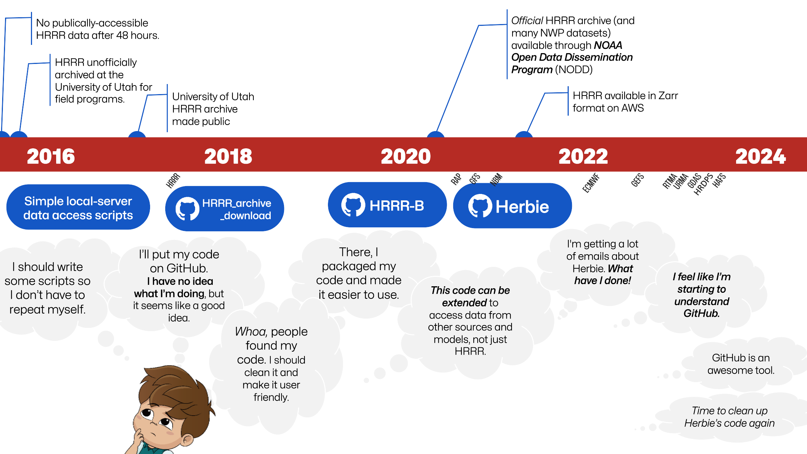

# 📜 Herbie's History

👨🏻‍🎓 During my PhD at the University of Utah, I created, at the time, the [only publicly-accessible archive of HRRR data](http://hrrr.chpc.utah.edu/). Over 1,000 research scientists and professionals used that archive. 

<blockquote><cite>

 Blaylock B., J. Horel and S. Liston, 2017: Cloud Archiving and Data Mining of High Resolution Rapid Refresh Model Output. Computers and Geosciences. 109, 43-50. <a href="https://doi.org/10.1016/j.cageo.2017.08.005">https://doi.org/10.1016/j.cageo.2017.08.005</a>.

</cite></blockquote>

Herbie was then developed to access HRRR data from that archive and was first used on the Open Science Grid.

<blockquote><cite>

 Blaylock, B. K., J. D. Horel, and C. Galli, 2018: High-Resolution Rapid Refresh Model Data Analytics Derived on the Open Science Grid to Assist Wildland Fire Weather Assessment. J. Atmos. Oceanic Technol., 35, 2213–2227, <a href="https://doi.org/10.1175/JTECH-D-18-0073.1">https://doi.org/10.1175/JTECH-D-18-0073.1</a>.

</cite></blockquote>

In the latter half of 2020, the HRRR dataset from 2014 to present was made available through the [NOAA Open Data Dissemination Program](https://www.noaa.gov/information-technology/open-data-dissemination) (formerly the NOAA Big Data Program). The latest version of Herbie organizes and expands my original download scripts into a more coherent package with the extended ability to download data for other models from many different archive sources, and it will continues to evolve.

**🌹 What's in a name?** I originally released this package under the name “HRRR-B” because it only worked with the HRRR dataset; the “B” was for Brian. Since then, I have added the ability to download many more models including RAP, GFS, ECMWF, GEFS, and RRFS with the potential to add more models in the future. Thus, this package was renamed **_Herbie_**, named after one of my favorite childhood movies.

The University of Utah MesoWest group now manages a [HRRR archive in Zarr format](http://hrrr.chpc.utah.edu/). Maybe someday, Herbie will be able to take advantage of that archive.
