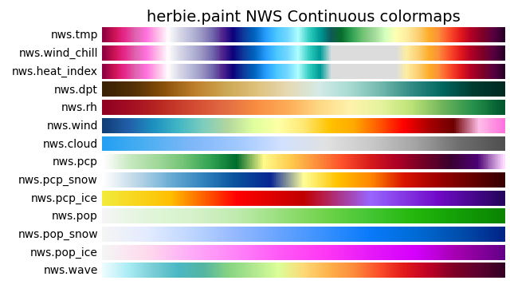
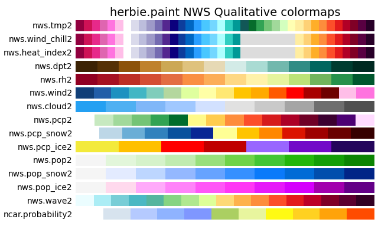
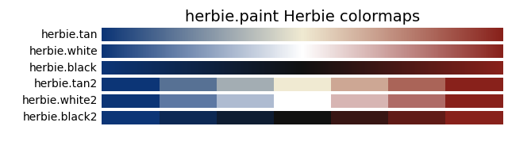
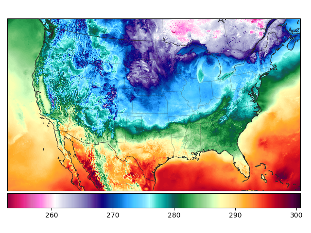
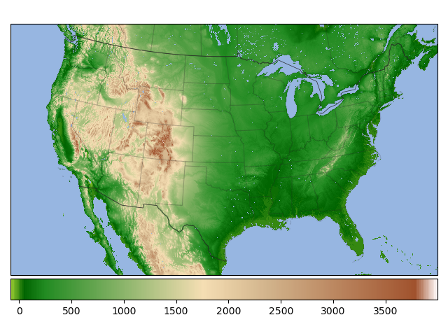
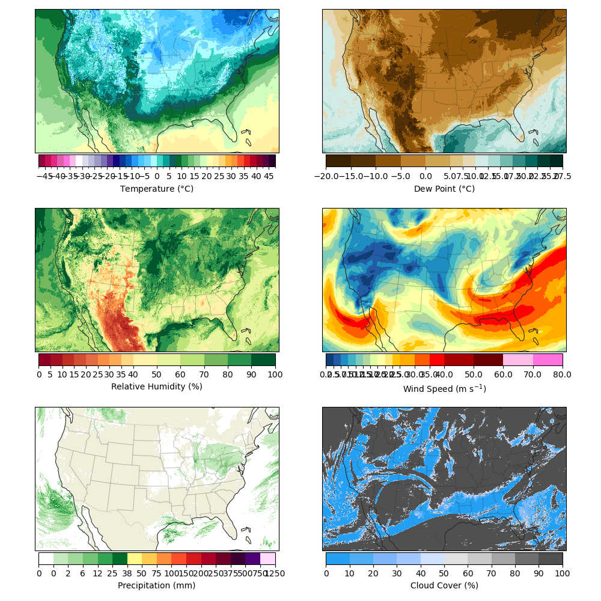
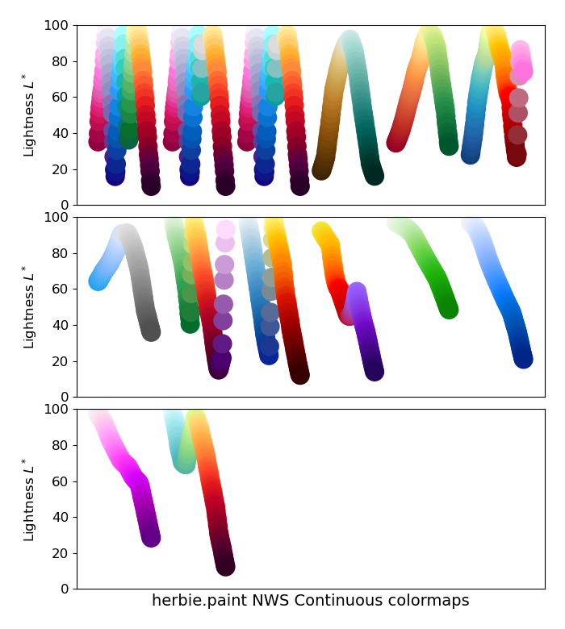
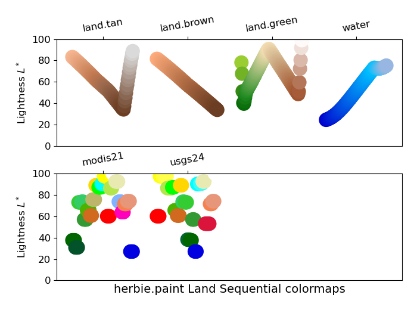
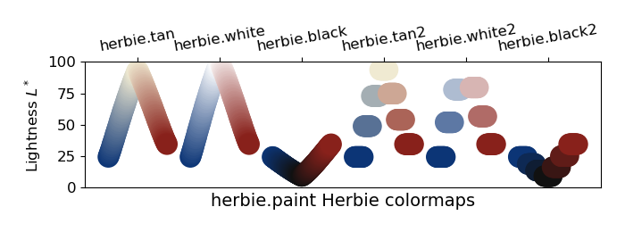

# 🎨 Paint: Herbie's Custom Colormaps

> **🚧 Work in progress:** The implementation of these colormaps are not mature and may change. I'm open to any Pull Requests that would help organize these paint cans so they can be used easier.

Herbie comes with it's own set of paint. These custom colormaps are registered with matplotlib when you import Herbie's paint:

```python
from herbie import paint
```

## National Weather Service Standard Colormaps

Some years ago I came across a document with the NWS standard color curves, proposed in 2018. I haven't been able to locate that document (or an updated official stance) since.



Segmented versions of ach colormaps are also given with the name `nws.{name}2`.



## Custom land color maps


## Herbie Colormaps

Diverging colormaps using the Herbie logo color palette are given.



## Basic usage

The most simple way to use these custom colormaps is to refer to the colormap name registered with matplotlib (e.g., `cmap="nws.tmp"`)

```python
from herbie import Herbie, paint
from herbie.toolbox import EasyMap, pc
import numpy as np

import matplotlib.pyplot as plt

H = Herbie("2024-01-01")
ds = H.xarray("TMP:2 m")

ax = EasyMap("50m", crs=ds.herbie.crs).BORDERS().STATES().ax
art = ax.pcolormesh(ds.longitude, ds.latitude, ds.t2m, cmap="nws.tmp", transform=pc)

plt.colorbar(art, ax=ax, orientation="horizontal", pad=0.01)
```



```python
t = H.terrain()
ax = EasyMap("50m", crs=ds.herbie.crs, add_coastlines=False).BORDERS().STATES().ax

art = ax.pcolormesh(t.longitude, t.latitude, t.orog, cmap="land.green", transform=pc)

plt.colorbar(art, ax=ax, orientation="horizontal", pad=0.01)
```




## Paint with intended bounds

These colormaps are designed for specific variable quantities. The paint classes used to define each colormap have a `kwargs` (sequential) and `kwargs2` (segmented) method which contains the `cmap` and `norm` objects appropriate for that colormap and the colorbar. 

```python
ax = EasyMap(crs=ds.herbie.crs).BORDERS().STATES().ax

plt.pcolormesh(
    ds.longitude,
    ds.latitude,
    (ds.t2m - 273.15),
    **paint.NWSTemperature.kwargs2,
    transform=pc,
)

plt.colorbar(
    orientation="horizontal",
    pad=0.01,
    shrink=0.8,
    **paint.NWSTemperature.cbar_kwargs2,
)
```


Here are other examples:




**NOTE:** Your data will need to be in the expected units.

| cmap Name        | herbie.paint Class                | Norm Units     |
| ---------------- | --------------------------------- | --------- |
| `nws.tmp`        | NWSTemperature                    | C         |
| `nws.wind_chill` | NWSWindChill                      | C         |
| `nws.heat_index` | NWSHeatIndex                      | C         |
| `nws.dpt`        | NWSDewPoint                       | C         |
| `nws.rh`         | NWSRelativeHumidity               | % (0-100) |
| `nws.wind`       | NWSWindSpeed                      | m/s       |
| `nws.cloud`      | NWSCloudCover                     | % (0-100) |
| `nws.pcp`        | NWSPrecipitation                  | mm        |
| `nws.pcp_snow`   | NWSPrecipitationSnow              | mm        |
| `nws.pcp_ice`    | NWSPrecipitationIce               | mm        |
| `nws.pop`        | NWSProbabilityofPrecipitation     | % (0-100) |
| `nws.pop_snow`   | NWSProbabilityofPrecipitationSnow | % (0-100) |
| `nws.pop_ice`    | NWSProbabilityofPrecipitationIce  | % (0-100) |
| `nws.wave`       | NWSWaveHeight                     | m         |
|                  |                                   |           |
| `land.tan`       | LandTan                           | m         |
| `land.brown`     | LandBrown                         | m         |
| `land.green`     | LandGreen                         | m         |
| `water`          | Water                             | m         |
|                  |                                   |           |


## Lightness





