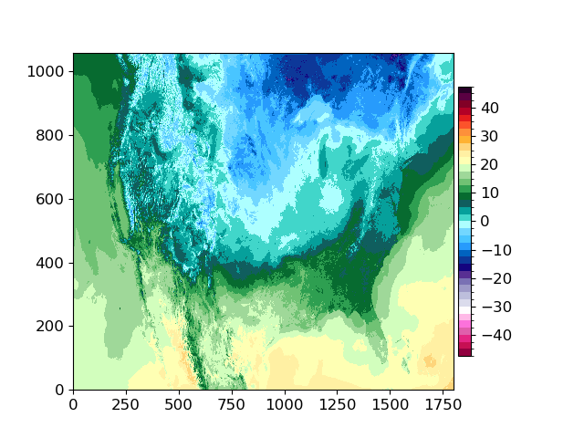

# Herbie Paint

Herbie comes with it's own set of new paint. These custom colormaps are registered with matplotlib when you import Herbie's paint:

```
from herbie import paint
```

## National Weather Service Standard Colormaps

Some years ago I came across a document of the NWS standard color curves, proposed in 2018. I haven't been able to locate that document since.


## Custom land color maps


## Colormaps with bounds

In practice, these colormaps are designed with specific bounds. The classes used to define each colormap have a `kwargs` method which contains the `cmap` and `norm` objects appropriate for that colormap.

Your data will need to be in the expected units.

| Name             | Class                             | Units     |
| ---------------- | --------------------------------- | --------- |
| `nws.tmp`        | NWSTemperature                    | C         |
| `nws.wind_chill` | NWSWindChill                      | C         |
| `nws.heat_index` | NWSHeatIndex                      | C         |
| `nws.dpt`        | NWSDewPoint                       | C         |
| `nws.rh`         | NWSRelativeHumidity               | % (0-100) |
| `nws.wind`       | NWSWindSpeed                      | m/s       |
| `nws.cloud`      | NWSCloudCover                     | % (0-100) |
| `nws.pcp`        | NWSPrecipitation                  | mm        |
| `nws.pcp_snow`   | NWSPrecipitationSnow              | mm        |
| `nws.pcp_ice`    | NWSPrecipitationIce               | mm        |
| `nws.pop`        | NWSProbabilityofPrecipitation     | % (0-100) |
| `nws.pop_snow`   | NWSProbabilityofPrecipitationSnow | % (0-100) |
| `nws.pop_ice`    | NWSProbabilityofPrecipitationIce  | % (0-100) |
| `nws.wave`       | NWSWaveHeight                     | m         |
|                  |                                   |           |
| `land.tan`       | LandTan                           | m         |
| `land.brown`     | LandBrown                         | m         |
| `land.green`     | LandGreen                         | m         |
| `water`          | Water                             | m         |
|                  |                                   |           |

```python
import matplotlib.pyplot as plt

from herbie import Herbie, paint

ds = Herbie("2024-01-01").xarray("TMP:2 m")
plt.pcolormesh(ds.t2m - 273.15, **paint.NWSTemperature.kwargs2)
plt.colorbar(shrink=0.8, pad=0.01)
```



## Lightness


