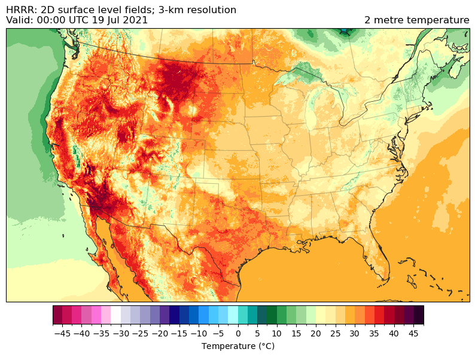
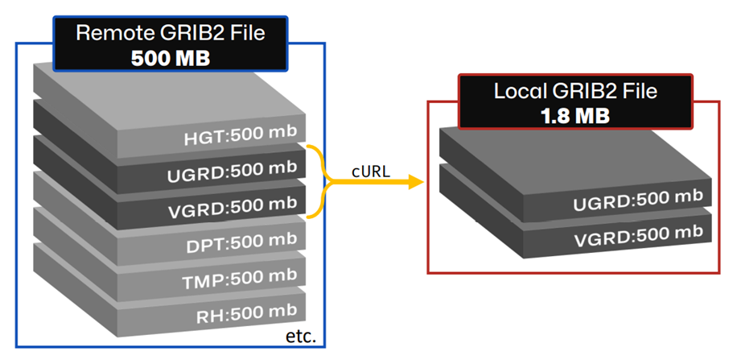

# Summary

Herbie is an open-source Python package that simplifies access to weather forecast data from numerical weather prediction (NWP) models stored in public cloud archives. Forecast model data is typically distributed as GRIB2 files, a compact binary format defined by the World Meteorological Organization (WMO). While these datasets are publicly available, they can be difficult to access and use due to complex, model-specific file structures and the need for specific software to read GRIB2 files.

Herbie lowers the barrier to entry for working with these datasets by enabling users to retrieve, subset, and open weather forecast model data with minimal input. By specifying a model name, initialization time, forecast lead time, and optional parameters, Herbie constructs the correct URLs, reads GRIB2 index files, and uses HTTP byte-range requests to retrieve individual fields or entire files. Results can be returned directly as xarray.Dataset objects, enabling seamless integration with the Python scientific ecosystem. This approach supports fast, efficient, and reproducible workflows for research, education, and operational forecasting.

# Statement of need

Although NWP data are freely distributed by agencies such as NOAA and ECMWF through platforms like NOMADS and public cloud programs (AWS, GCP, Azure), it is not intuitive how to access this data. Locating the correct files, inspecting their contents, and extracting relevant fields often requires custom scripts and deep knowledge of the data archive.

Herbie lowers these technical barriers, especially for new users, by providing a consistent, high-level Python interface to access GRIB2 files from various remote sources. It automates many common—but tedious—tasks in data retrieval: constructing URLs, listing file contents from index files, downloading selected fields, and loading them into usable Python data structures.

Earlier work `[@Blaylock2017:2017; @Blaylock2018:2018]` demonstrated methods for accessing and visualizing archived GRIB2 data. Herbie generalizes and extends those ideas into a reusable and extensible tool that supports multiple models and data sources.

Herbie is used by students, researchers, engineers, operational meteorologists, and many others for:

- Rapid prototyping of forecast applications
- Automating data retrieval for analysis and machine learning workflows
- Creating time-lapse visualizations from archived model output
- Teaching students how to use NWP datasets

Examples of research supported by Herbie include `@Willett2022:2022`, `@Baldwin2023:2023`, and `@Schumacher2025:2025`.

# Functionality

Herbie's core features are:

1. Locating remote GRIB2 files based on model type, initialization time, and forecast hour
2. Listing file contents using remote index files, allowing users to inspect metadata without downloading the entire file
3. Downloading full GRIB2 files or individual fields using byte-range HTTP requests
4. Loading fields into xarray.Dataset objects using cfgrib, enabling analysis or visualization in the Python scientific stack.

Herbie supports major models including HRRR, RAP, GFS, IFS, AIFS, and others. These are accessed through data providers such as NOAA NOMADS, the NOAA Open Data Dissemination (NODD) program, ECMWF’s open data portal, and others. Users can extend Herbie by writing custom plugins to define additional model templates, support private networks, or read from local archives.

Other features include calculating wind speed and direction and extracting data at specific point locations.

# Implementation

Herbie is written in pure Python and uses requests for HTTP access and pandas, xarray, and cfgrib for data wrangling. The package comes with templates for each NWP model that defines URL format of the data archive. Adding support for new models involves writing a custom template class.

To avoid downloading large files unnecessarily, Herbie uses remote .idx (index) files to locate individual fields within GRIB2 files by byte offset. These offsets are then used to download only the required sections of the file—a highly efficient method for accessing large datasets over the network.

Herbie is available on PyPI and conda-forge as herbie-data and is documented at https://herbie.readthedocs.io.

# GRIB File Format

Most NWP output is distributed in GRIB (GRIdded Binary) format, a binary format defined by the WMO. There are two versions—GRIB1 and GRIB2—with the latter being more widely used today.

Each GRIB file contains a sequence of records (“messages”), where each message represents a single variable at a specific level, forecast time, and spatial domain. A helpful analogy is to imagine a GRIB file as a stack of pancakes, where each layer is one field (e.g., temperature at 500 hPa). A single file may contain hundreds of such fields. GRIB’s compact binary encoding makes it efficient for storing and transferring large volumes of data but more difficult to inspect or manipulate directly compared to plain text formats.

To facilitate access, GRIB files are often distributed alongside index files (e.g., .idx), which provide metadata and byte offsets for each field. These index files enable users to extract specific fields without downloading the entire file—an approach that Herbie leverages.

Several python tools exist to read GRIB files: pygrib and cfgrib. Commond-line tools include wgrib, wgrib2, and ecCodes. Herbie primarily leverages the features of cfgrib, but uses all these tools to some extent.

# Limitations

Herbie currently supports NWP data available in GRIB2 format and their associated index files. The GRIB2 format does not support regional subsetting of GRIB2 files from remote sources. However, the distribution of NWP data in cloud-optimized formats like Zarr will enable more efficient slicing of datasets customized for user needs. In the future, Herbie may support access to these datasets. Users are also invited to look at tools like `@kerchunk:2025` and `@VirtualiZarr:2025`.

# Acknowledgements

Herbie builds on the work of many open-source libraries including xarray `[@Hoyer_xarray_N-D_labeled_2017:2017]`, `@cfgrib`, Pandas `[@The_pandas_development_team_pandas-dev_pandas_Pandas]`, and `@requests`. Development of Herbie has benefited from feedback and contributions from its users.

# References
